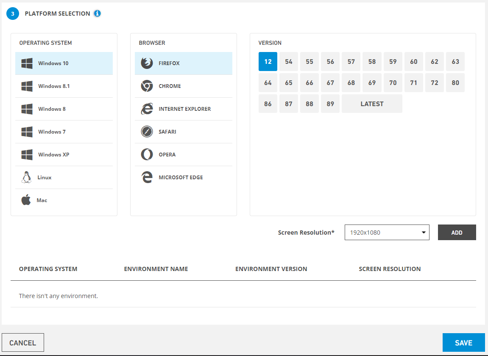

# Edit Plans

### Edit Plans

All defined plans are listed on the listing screen. The last four icons in the list area are for **Edit**, **Delete**, **Test Report** and **Run Plan.**

.PNG>)

Click the Edit icon for the record you want to update from the list. System displays the system tabs:

&#x20;

**On the screen that opens;**

**Select a project** for which you want to edit a plan.

**Search** for the project you want to plan, then check the **checkbox** and select the project. The selected project is displayed on the **scenario order.** All projects are selected by ticking the **select all checkbox.**

****

_The Operation System, Browser and Version_ to run the plan are selected.

Select Screen Resolution from the bottom bar and click the Add button.

&#x20;

System Admin changes the field he wants to update at each step and clicks the Save button. System information is updated. To cancel the update process Cancel button must be clicked.
