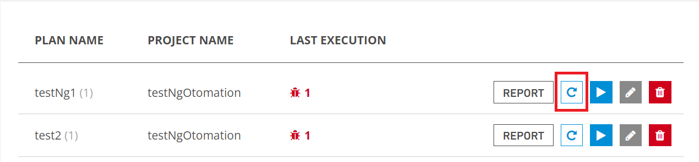
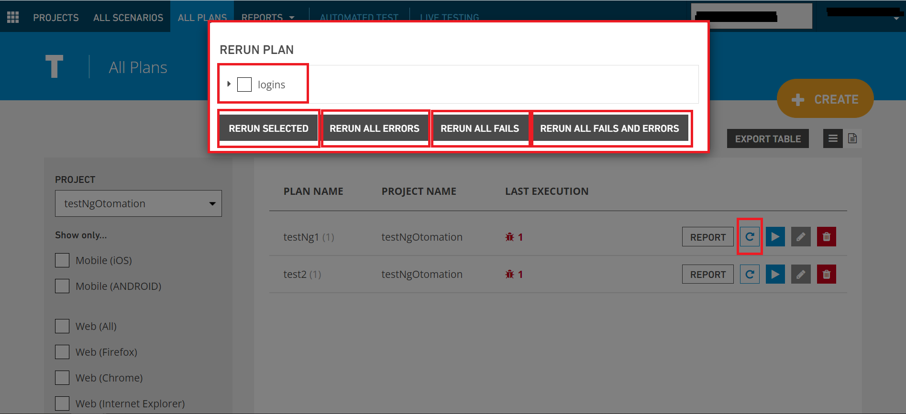

# Rerun Plan

Click the **Rerun** button and the following popup will appear.

The plan to rerun is selected and the conditions for which it will be run are selected.

**Rerun Selected:** Runs the selected plan as it is.

**Rerun All Errors:** Reruns all errors.

**Rerun All Fails:** Runs all failed plans.

**Rerun All Fails** And Errors: Runs all plans that fail and get errors.

