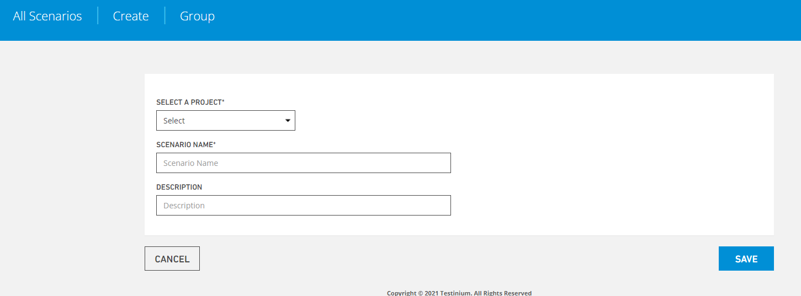

# Create New Group

Lets you create a new scenario group.

**Select A Project,** allows you to select your project that you want to create a scenario for.

**Scenario Name**, is the part you named the scenario

**Description,** this is the part for explanation.

**Save**, the system saves the new scenario value to the system.

**Cancel,**If the Cancel button is pressed, the system cancels the scenario definition process.

