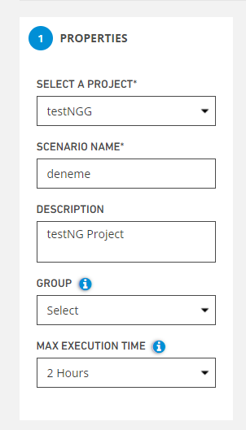
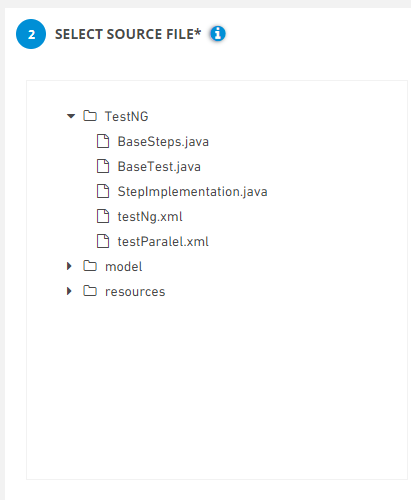
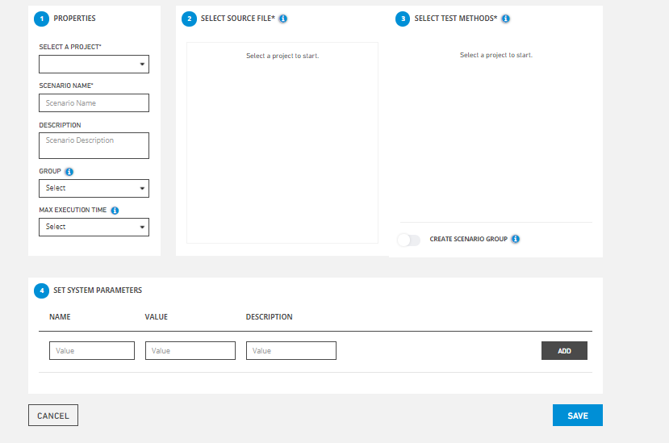

# Create

**Create New Scenarios:** It is the screen where a new scenario definition is made in the system. Before this process, Project Name must be selected on the listing screen. Otherwise, the system gives an error message that the new scenario operation cannot be performed without selecting a project name. The system also applies filtering on the listing screen according to the selected project name.

**1.Properties,** this is the field where the properties of the project to be created are entered.

* **Select A Project**, allows you to select the project or one of the projects you have created.
* **Scenario Name,** this is the field where you will give the name of the scenario you will create.
* **Description**, this is the field where you can add a description about the scenario.
* **Group**, you can group multiple scenarios under a group name
* **Max Execution Time,** If a test run within this time limit, it will be cancelled.

**2. Select Source File;** this is the screen where your test files of your project are listed.

**3. Select Test Method;** your test methods are listed from the given test files

* **Select All,** allows you to select all tests.
* **Create Scenario Group,** you can select multiple scenarios and name the group like a scenario as what you type in SCENARIO NAME field on left.

.PNG>)

**4. Set System Parameters;** allows you to set system parameters.The required fields for the parameters are below,

* **Name**
* **Value**
* **Description**

**Add** ,Allows to save system parameters.

**Save,**the system saves the new scenario value to the system.

**Cancel,** If the Cancel button is pressed, the system cancels the scenario definition process.

****
