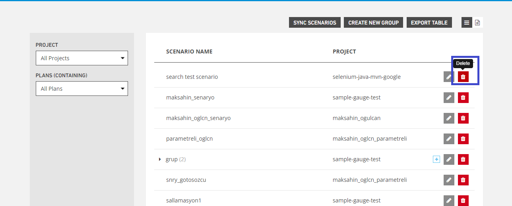

# Delete Scenarios

**Delete** button allows deletion of the created scenario.

In the pop-up that appears, the Yes button is pressed in response to the question "Are you sure you want to delete this record?". If the No button is pressed, the system cancels the deletion process.

.PNG>)
