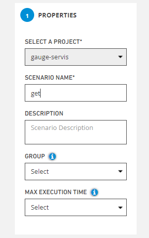

# Edit Scenarios

**Edit**, It allows you to go to the details of the scenario created by clicking the button and make adjustments.

**1.Properties**

**Select A Project,** this is the field where the project name of the scenario to be edited is selected.The project name will be automatically selected here

**Scenario Name,** this is the field where you will give the name of the scenario you will create.

**Description**, this is the field where you can add a description about the scenario.

**Group**, you can group multiple scenarios under a group name.

**Max Execution Time,** If a test run within this time limit, it will be cancelled.

****

**2. Select Source File;** this is the screen where your test files of your project are listed.

**3. Select Test Method;** your test methods are listed from the given test files

**Select All,** allows you to select all tests.

**Create Scenario Group,** you can select multiple scenarios and name the group like a scenario as what you type in SCENARIO NAME field on left.

.PNG>)

**File Content,** it allows you to make changes to the test steps in the file and save them with the save button.

.png>)

**4. Set System Parameters;** allows you to set system parameters.The required fields for the parameters are below,

* **Name**
* **Value**
* **Description**

**Add** ,Allows to save system parameters.

**Apply,** enables the changes to be applied.

**Save,**the system saves the new scenario value to the system.

**Cancel,** If the Cancel button is pressed, the system cancels the scenario definition process.

**Ide**, it allows you to make changes to your code in your project.

The **Save button** allows you to save the changes made.

