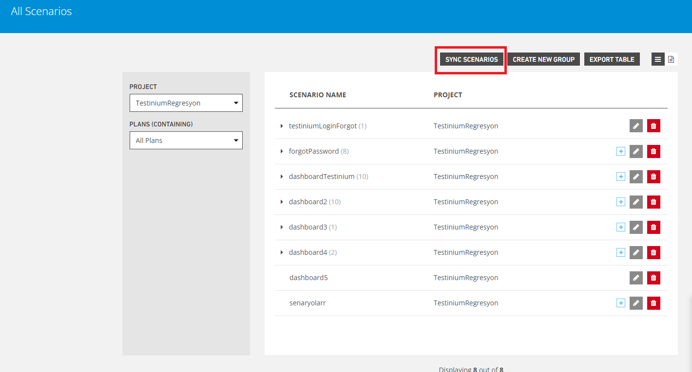

# Sync Sicenarios

Provides scenario synchronization.

It provides editing between methods, performs operations such as adding and removing methods.

**Sort By-Recently Added,**allows scenarios to be listed from current to oldest.

**Sort By-Project Name,** allows scenarios to be listed in alphabetical order.

**1.Project**

is the area that enables the selection of the project.

**2.Methods To Import**

Provides file selection for create scenario.

**File Name**,keeps filenames selected.

**Next,**allows to progress to the next step.

**3.Methods To Remove**

This is the part where the files to be removed from the scenario are selected.

**4.Summary**

It is the section where added and deleted scenarios are shown.

**Start Over,** allows reworking the editing process.

**Finis**,ends the editing analysis.

****
