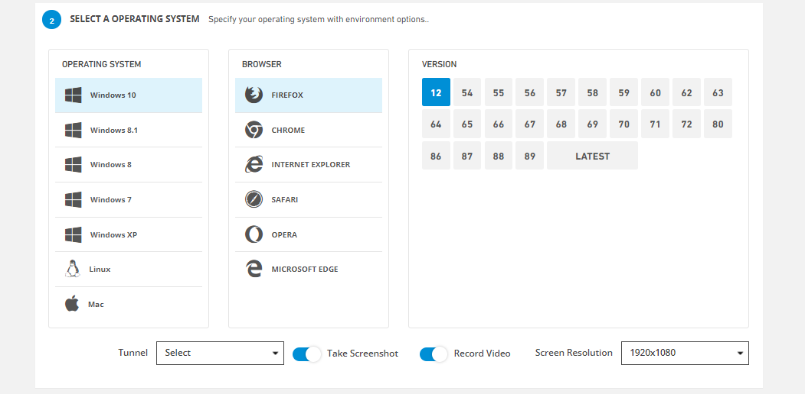

# Test Code Generator(Web)

**1.Select A Platform**

Lets you choose the platform on which you want to run your test.Platforms to choose from;

* Web

.PNG>)

**2.Select A Operating System**

It allows you to choose the Operating system, browser and version you want to run your test.Fields to choose from;

* Operating System
* Browser
* Version

**Take Screenshot,** allows you to take a screenshot of the test run.

**Record Video,** allows you to take a record video of the test run.

**Screen Resolution** ,sets the screen size of the window in which the automation will run.

It is the part of the code created so that you can run it in your local environment.

Executable code options;

* Java
* C#
* Pytho
* Ruby
* Node

