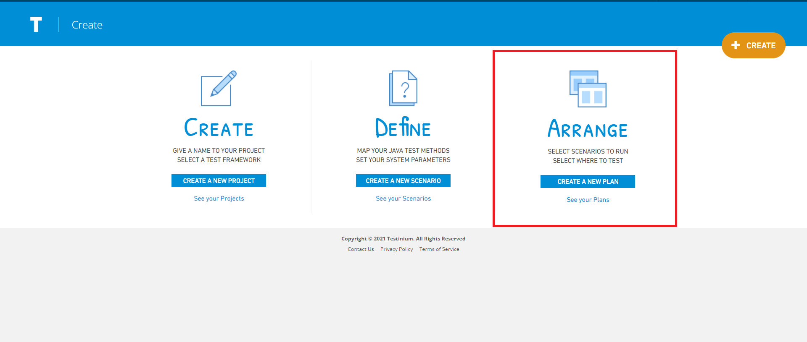
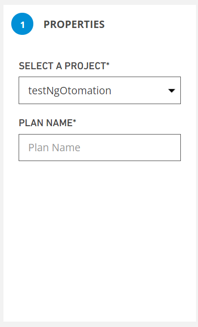
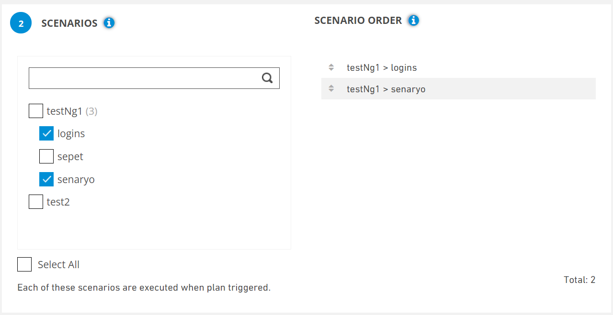
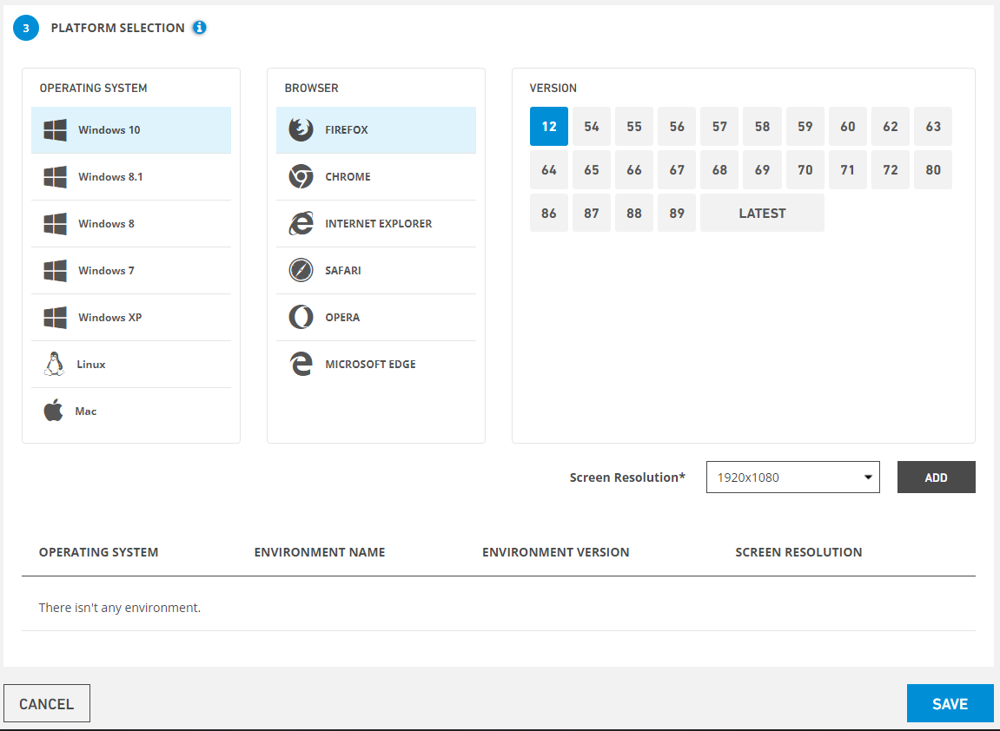

# Create A New Plan

Testinium -> Create -> Arrange -> Create A New Plan

It is redirected to the plan creation page with the steps given above.

All Plans -> Create

It is the screen where a new plan definition is made in the system. Before creating a new plan, it is mandatory to select Project Name from the homepage. If the Create a new plan button is clicked without selecting the Project Name, the system displays the error message regarding the selection of the project name.

**On the screen that opens;**

**Select a project** for which you want to create a plan.

Enter the name you want to give your **plan name**.

**Search** for the project you want to plan, then check the **checkbox** and select the project. The selected project is displayed on the **scenario order.** All projects are selected by ticking the **select all checkbox.**

****

_The Operation System, Browser and Version_ to run the plan are selected.

Select Screen Resolution from the bottom bar and click the Add button.

To delete the added plan, click the delete button on the right.

These values are entered and the Next button is clicked. The system displays the Mobile Platform Selection screen. If Cancel is clicked, the system cancels the process of adding a new plan.
