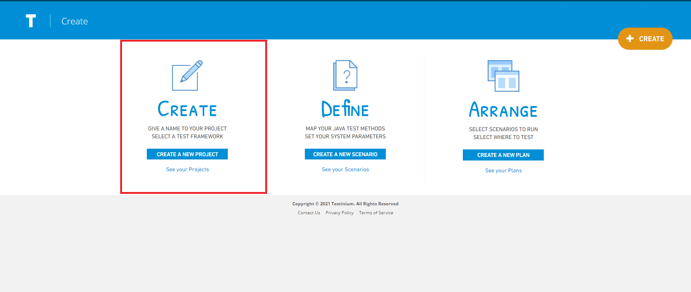

# Create A New Project

Testinium -> Create -> Create-> Create A New Project

It will be redirected to the project creation page with the steps given above.

Projects -> Create

**If the choice is Selenium;**

On the pop-up screen;

&#x20;

_1. Test Framework_

_2. Test File Type_

_3. Test Runner Tool_

_4. Project Name_

_5. GIT Project Folder Name (This is where the test codes are located)_

**Create From Template;** We'll create a sample web project based on a url give.The desired url address is entered in the relevant field.

These values are entered and the Save button is clicked. The system saves the new project&#x20;

definition. If the Cancel button is clicked, the system cancels the new Project definition process.

On the pop-up screen;

**If the choice is Appium;**

&#x20;__&#x20;

_1.Test Framework_&#x20;

_2.Test File Type_

_3.Project Name_

_4.GIT Project Folder Name_

_5.IOS Mobile App_&#x20;

_6.Android Mobile App_&#x20;

**Create From Template;** We'll create a sample web project based on a url give.The desired url address is entered in the relevant field.

These values are entered and the Save button is clicked. The system saves the new project definition. If the Cancel button is clicked, the system cancels the new project definition process.

**If the choice is Service;**

On the pop-up screen;

&#x20;

_1. Test Framework_

_2. Test File Type_

_3. Test Runner Tool_

_4. Project Name_

_5. GIT Project Folder Name (This is where the test codes are located)_

**Create From Template;** We'll create a sample web project based on a url give.The desired url address is entered in the relevant field.

These values are entered and the Save button is clicked. The system saves the new project&#x20;

definition. If the Cancel button is clicked, the system cancels the new Project definition process.

