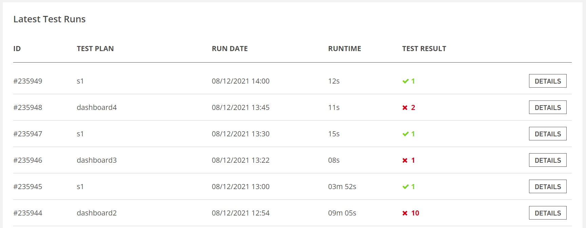

# Dashboard

After the login process is completed, it is directed to the **dashboard** screen.

If the Dashboard is analyzed from top to bottom; Projects, All Scenarios, All Plans, and Reports appear.At the top right, there are the promotion button, user name, profile, account information, log out tabs.

* **Trial Plan**, remaining credits.
* **Parallel Tests**, limit of tests can run at the same time.
* **Queued Tests**, Indicates the number of tests in the queue.
* **Active Tests - Plans**, currently running test number and plan.

* It shows the number of tests in the queue, if there are more tests in the queue than your parallel limit, you can get more parallel tests with the "contact us" button.

**Latest Test Runs**, lists the most recently run tests in your testinium account by ID, Test Plan, Run Date, Runtime, Test Result.

By clicking the **Detail** button, the scenario run details are accessed.

It is directed to the Execution of Reports screen with the Detail button.

