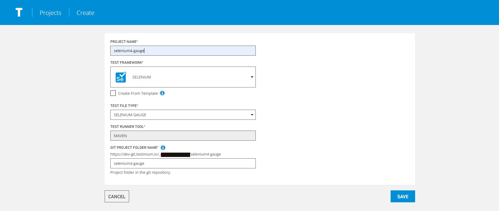
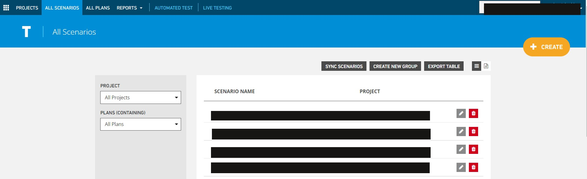
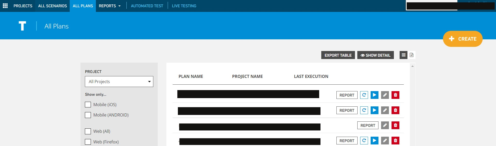
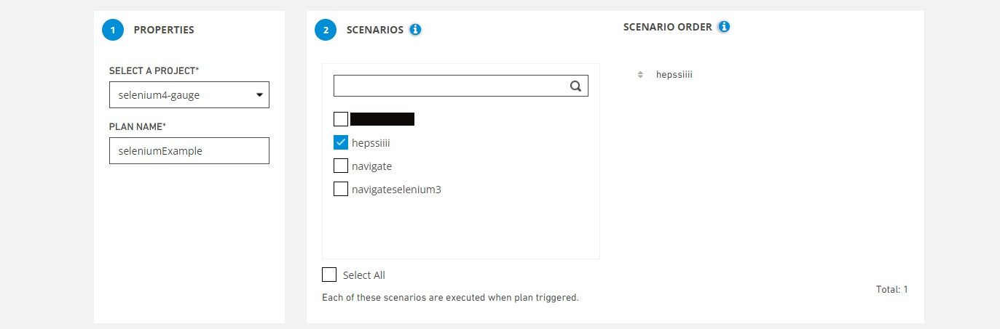

# Selenium Project

Testinium supports java, gauge and cucumber frameworks in selenium projects.

### **Selenium-Gauge**

In projects created with **Selenium-Gauge**, what should be in the project;

\-Projects created with selenium-gauge must have unique tags.

.png>)

\-manifest.json file must contain xml report plugin.

.png>)

\-.gitignore file should be project directory.

\-Target file should not be pushed to remote repository

\-The hub url must be specified for the remote driver to work.

.png>)

### **Selenium-Java**

In projects created with **Selenium-Java**, what should be in the project;

\-gitignore file should be in project directory.

\-Target file should not be pushed to remote repository

\-The hub url must be specified for the remote driver to work.

.png>)

### **Selenium-Cucumber**

In projects created with **Selenium-Cucumber**, what should be in the project;

\-Feature files should be under src/resources directory.

.png>)

\-gitignore file should be in project directory.

\-Target file should not be pushed to remote repository

\-The hub url must be specified for the remote driver to work

.png>)

### Project Creation

To create a Selenium project, name the project, select Selenium framework(java-gauge-cucumber). For example, the file type to work with Selenium-gauge is selected.

It is indicated on the screen that it will be created as a maven project by default.

The repository link of the git account to which the source codes of the project will be sent is displayed.

A new project is created on the system by clicking the Save button.

Then, the source code of the project should be sent to the link address of the git repository given in the system.

### Scenario Creation

Click the create button on the all scenarios screen to create a scenario for the project.

**1.Properties**

In order to create a scenario, we must first select the project from the **Select A Project** field on the screen that opens.

We give a name to the **Scenario Name** field for the scenario we will create.

&#x20;**Description** is the field where comments about the Scenario are added.

**Group** is the area where you can group multiple scenarios under one group.

The **Maximum Execution Time** field is for selecting the maximum time the test should run. If a test continues to run up to this time limit, it will be aborted.

**2.Select Source File**

Select Source File is the area where your test files in the given repository are listed.

Allows you to select the test file you want**.**

**3.Select Test Methods**

This is the area where your test methods from the given test files are listed.

The scenario is created by selecting the desired test method or methods.

**Create Scenario Group**, allows you to select multiple test cases.

You can also **select all** your test cases with select all radio button.

.png>)

It is the screen where the scenario steps in the spec file of the test method you selected are displayed.

It allows you to make and save the changes and edits you want in the test steps in your scenario.

.png>)

You can define necessary system parameters in this area.(Optional) Then you can use these parameters in your test code. Testinium will export these parameters to the system that will run the tests.

.png>)

### Plan Create

A plan should be created for the project and scenario created after the above processes.

You can create a new plan by clicking the **create** button on the "**all plan**" screen.

Relevant fields are filled on the screen that opens.

**1.Properties**

**Select A Project**, **** is the area where the project selection for which the plan is to be created is made.

**Plan Name** is the field where you name the created plan.

**2.Scenarios**

Your scenarios are listed from the selected project. This is where you can select multiple scenarios to add a test plan.

**3.Scenario Order**

It allows you to sort among the selected scenarios. Scenarios are executed according to the selected order.

**3.Platform Selection**

It offers the opportunity to run your scenarios on the platform you want.

For example, you can select the operating system as windows 10, the browser as chrome and the latest version and run your test on this platform.

You can choose the screen resolution from the options and save all your choices with the add button.

The operating system, environment name, environment version and screen resolution you selected are displayed on the screen.

You can delete the selected operating system, environment name, environment version and screen resolution with the Delete button.You can re-select and add.

With the save button, you can save your transactions and create your plan.

.png>)

After these processes, the project, scenario and plan that you will run in the testinium environment will be created.
