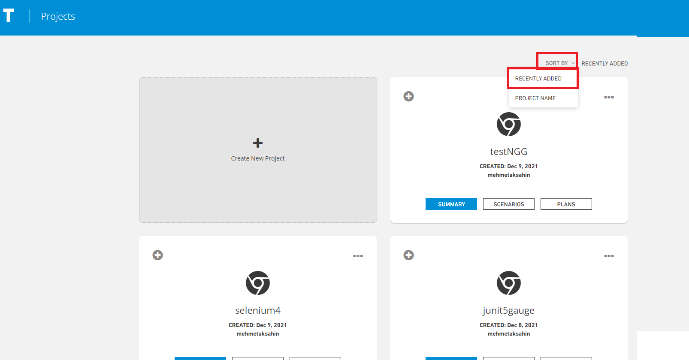
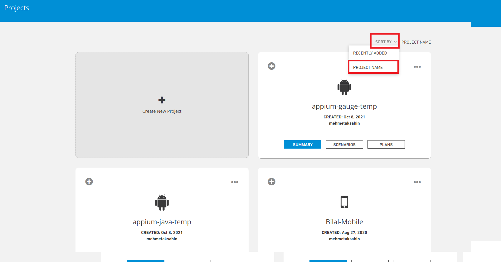
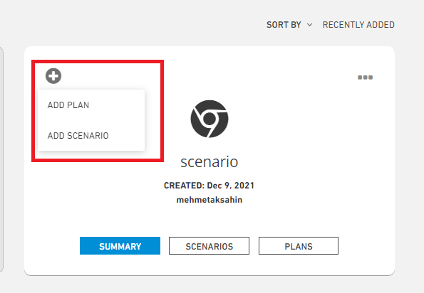
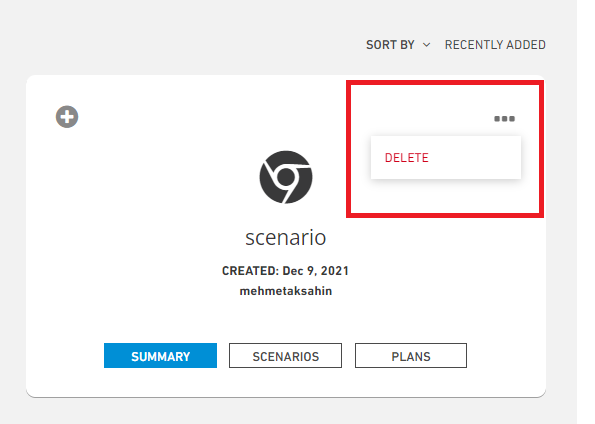

# Projects

It is the area where we upload the project that enables it to be tested by creating a project and plan in the system.

For the framework you want to run, a Service project is created with the Creat New Project steps from the Project screen.

Testinium -> Projects

* **Sort By (Recently Added);** Sorts by the most recently added project.

* **Sort By (Project Name);** Sorts them alphabetically by project name.

**"+"** By clicking on the button, you will be directed to the project adding and plan adding pages.

****

**"---"** By clicking the button, the created project is deleted

****

****

