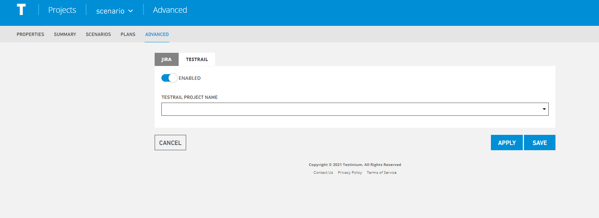

# Advenced

It is the area where the integration of the project with **jira and testrail** is provided.

**Enable** button must be selected for Jira and testrail connection.

**TestRail Project Name,** Write the name to be given to the project.

**Apply,** enables the changes to be applied.

**Save,**the system saves the new scenario value to the system.

**Cancel,** If the Cancel button is pressed, the system cancels the scenario definition process.

****
