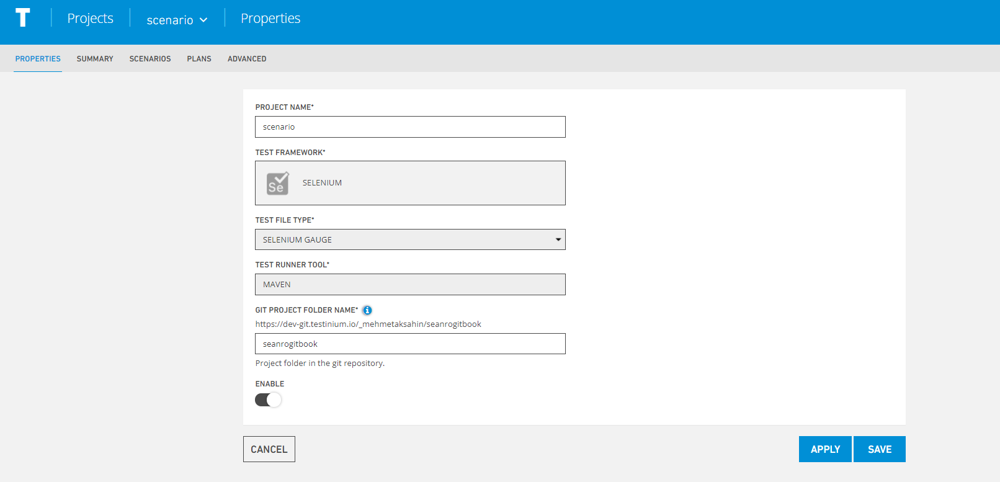

# Properties

Allows you to make changes from Project Name, Git Project Folder Name fields.

**Apply,** enables the changes to be applied.

**Save,**the system saves the new scenario value to the system.

**Cancel,** If the Cancel button is pressed, the system cancels the scenario definition process.

