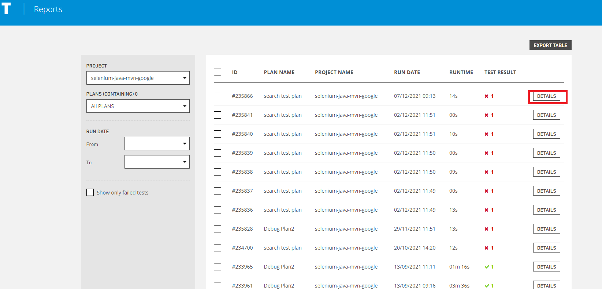
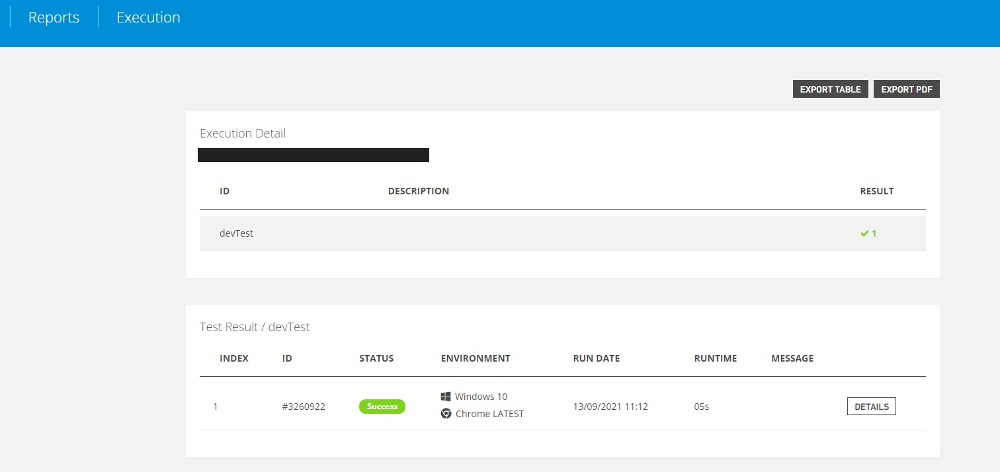
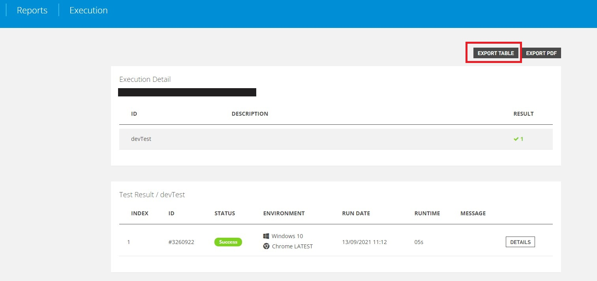
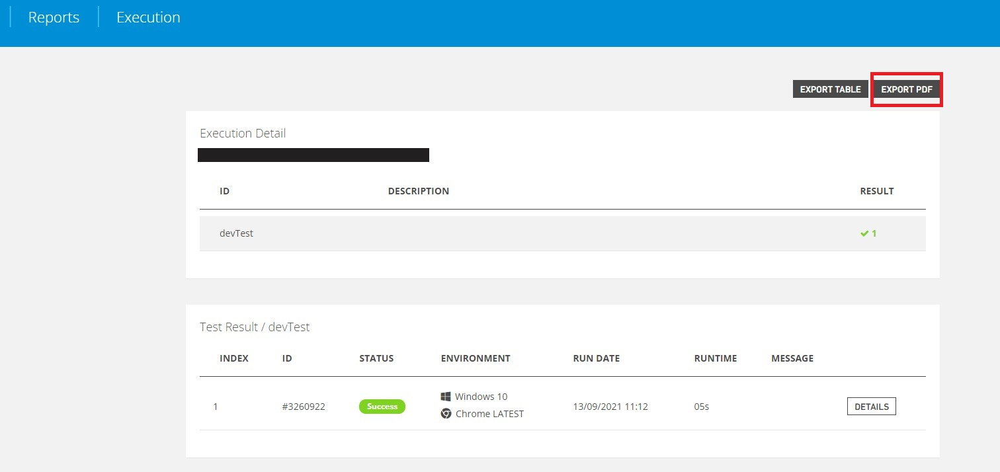
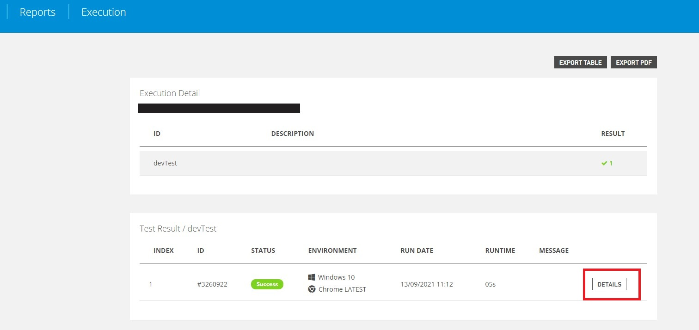
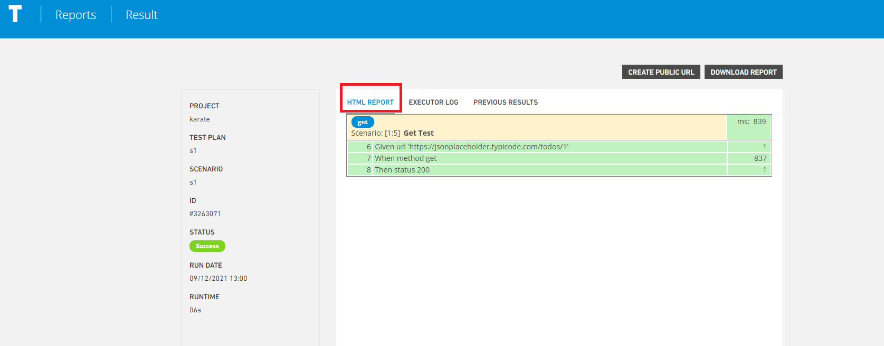
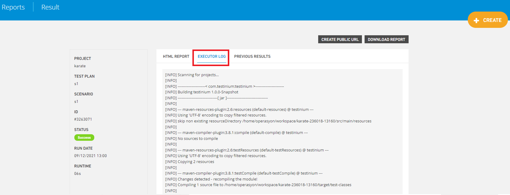
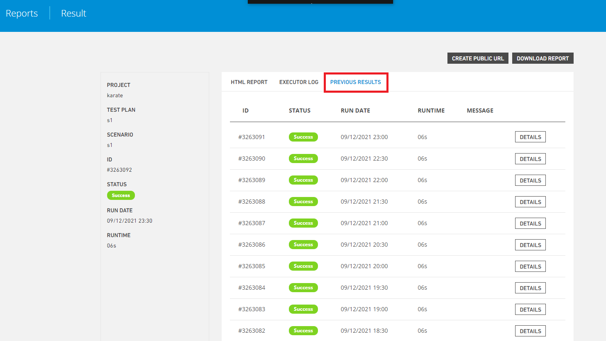
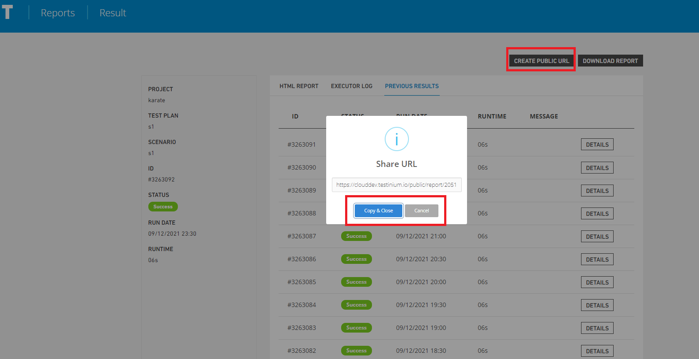
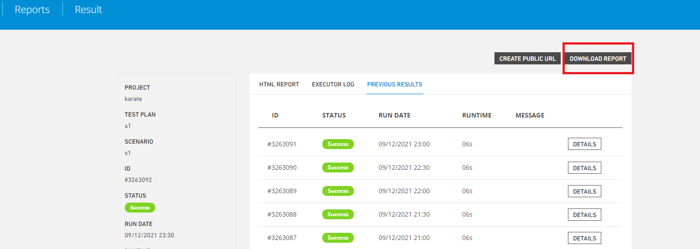

# Test Execution(Auto)

These are the reports that show the result of a plan after it is run completely on the basis of all scenarios and browser/phone.

Testinium -> Reports -> Test Executions(Auto)

The detail of the test result run in the system is displayed. User should select a record from the list and click the Details button.

**Project,**Selection of the project whose report will b e accessed is provided.

**Plans(Containing)**, allows you to select the plan for the selected project.

**Run Date(From)**, it provides the fetching of the plans that were run in the date range.

**Export Table,** it enables the information of the selected plan to be transferred to the excel document.

**Create**, provides direction for creating projects, scenarios and plans.

**Details** by clicking the Detail button, the details of the plan execution are accessed.

It is directed to the Execution of Reports screen with the Detail button.

Exports the scenario information run by clicking the **Export Table** button to excel.

It allows us to export the run scenario information as a pdf document by clicking the **Export Pdf** button.

By clicking the **Detail** button, you can be directed to the report screen showing the results of the scenario you have run.

It allows you to view the **Htlm Report** of the scenario you have executed.

It allows you to view the **Executor logs** of the scenario you are running.

The **Previous Results** button displays all the executed scenarios of the respective project.

Allows to create a public report url, **create public url** button.The url created with the **copy-close** button is copied and the opened window is closed.The **cancel** button cancels the url copy and closes the window.

**Download Report** It allows you to download your report outputs in zip file format.

**Screenshots** is taken to observe where the run tests pass or fail.

.PNG>)

**Video** recording is taken to observe where the tests run were passed or failed.

.PNG>)

